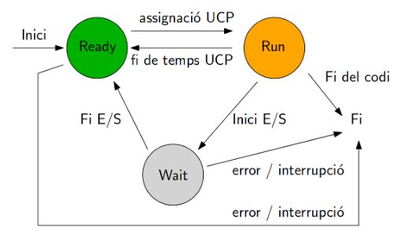

# Estats d'un Procés:
- Ready:
  En aquest estat, el procés està preparat per ser executat i ha estat carregat a la memòria. No està utilitzant actualment la CPU, però està disponible per ser programat.
- Run:
  En aquest estat, el procés té accés a la CPU i està executant les seves instruccions. Només un procés pot estar en aquest estat a la vegada per cada unitat de processador.
- Wait:
  Quan un procés espera per algun esdeveniment (com ara entrada/sortida o una resposta a una crida de sistema), entra en l'estat bloquejat. Durant aquest temps, no utilitza la CPU i allibera recursos.
  